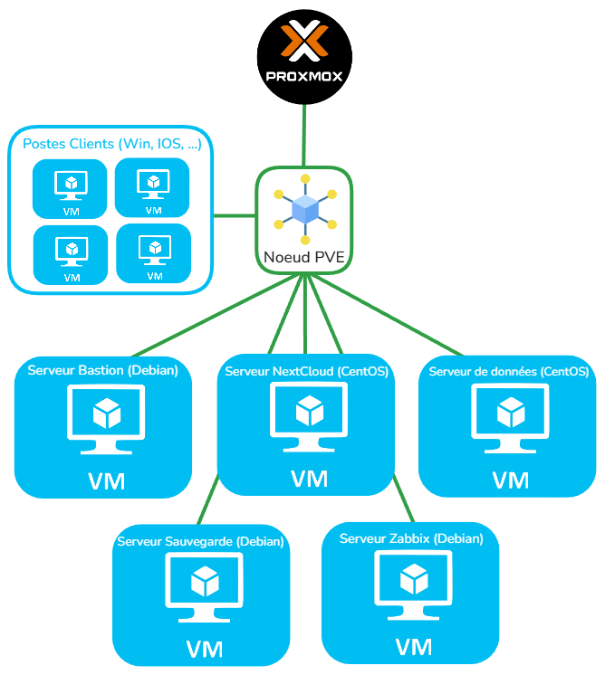

# TP_Audit_and_Sec_of_MedData

## Scénario :
Vous êtes des administrateurs réseaux et sécurité travaillant pour une petite entreprise
de cybersécurité appelée SecureSys, spécialisée dans l’audit et la sécurisation des
systèmes d’information de ses clients. SecureSys a récemment décroché un contrat
pour moderniser et sécuriser l’infrastructure d’un client critique, MedData, une
société de stockage et d’analyse de données médicales.

<br>

## Aperçu du projet



<br>

Il est préférable de cloner ce repo pour posséder directement l'intégralité des fichiers et pouvoir les consulter en local, commande :

```bash
git clone https://github.com/m1d0b4n/TP_Audit_and_Sec_of_MedData.git
```

<br>

## Table des matières

<details>
<summary>Arborescence de l'infrastructure réseau</summary>
<br>

```
.
├── Hyperviseur (Proxmox)
│   └── Noeud PVE
│       ├── VLAN Administration (10.0.1.0/24)
│       │   └── VM - Bastion (Debian)
│       │       └── IP : 10.0.1.2
│       │       └── Rôle : Point d'accès SSH sécurisé pour les administrateurs
│       │
│       ├── VLAN Applicatif (10.0.2.0/24)
│       │   └── VM - Server Nextcloud (CentOS)
│       │       └── IP : 10.0.2.10
│       │       └── Rôle : Serveur Nextcloud pour le stockage
│       │       └── Configuration : Connexion à la base de données dans le VLAN Bases de données
│       │
│       ├── VLAN Bases de données (10.0.3.0/24)
│       │   └── VM - Serveur Base de données (CentOS)
│       │       └── IP : 10.0.3.10
│       │       └── Rôle : Base de données Nextcloud, uniquement accessible depuis le serveur Nextcloud
│       │       └── Configuration : Accès limité aux requêtes de 10.0.2.10 via ACLs
│       │
│       ├── VLAN Sauvegarde (10.0.4.0/24)
│       │   └── VM - Sauvegarde (Debian)
│       │       └── IP : 10.0.4.10
│       │       └── Rôle : Serveur de sauvegarde pour les VMs
│       │       └── Configuration : Snapshots et planification des sauvegardes
│       │
│       ├── VLAN Monitoring (10.0.5.0/24)
│       │   └── VM - Zabbix (Debian)
│       │       └── IP : 10.0.5.10
│       │       └── Rôle : Surveillance et monitoring de l'infrastructure
│       │       └── Configuration : Alertes et tableaux de bord
│       │
│       └── VLAN Utilisateurs (10.0.6.0/24)
│           └── Terminaux utilisateurs (Plage DHCP : 10.0.6.100 - 10.0.6.200)
│               └── Rôle : Accès utilisateur final avec restrictions d'accès
```
</details>

<details>
<summary>Aperçu de l'interface PROXMOX</summary>
<br>


</details>

<details>
<summary>Plan réseau Cisco Packet Tracer</summary>
<br>

* Le fichier Packet Tracer ce trouve dans le répertoire : ```./ressources/tp_packettracer.pkt```
* Ce réferer également à la table d'adressage : ```./ressources/table_adressage_IP```

>Voici un aperçu :


</details>

<details>
<summary>Annuaire des utilisateurs, groupe et leurs rôles</summary>
<br>

| Groupe                  | Utilisateurs               | Rôle                                         | Accès                                                                                     |
|-------------------------|----------------------------|----------------------------------------------|-------------------------------------------------------------------------------------------|
| **Administrateurs**     | Rudy                       | Administrateur système                       | Accès complet au VLAN Administration, VLAN Applicatif, Sauvegarde, Bastion                |
|                         | Kevin                      | Administrateur réseau                        | Accès complet au VLAN Administration, configuration des routeurs et switches              |
|                         | Clément                    | Administrateur sécurité                      | Accès complet au VLAN Administration, gestion des pare-feux et politiques de sécurité     |
| **Médecins**            | Dr. Gregory House            | Médecin généraliste                          | Accès à Nextcloud, limité aux dossiers médicaux des patients                              |
|                         | Dr. Anna Tomie           | Médecin spécialiste                          | Accès à Nextcloud, accès restreint aux dossiers liés à son domaine                        |
| **Assistants médicaux** | Anne Tiseptique             | Assistante médicale                          | Accès à Nextcloud, accès restreint aux dossiers des patients pour mise à jour administrative |
| **Analystes de données**| Bill Athéral                | Analyste de données médicales                | Accès limité à Nextcloud pour les données et rapports, accès à Zabbix pour monitoring     |
| **Techniciens de maintenance** | Rémi Dié        | Technicien IT                                | Accès au serveur Bastion, équipements réseau et VLAN Administration pour support          |
| **R&D**                 | Dr. Patricia Ologie           | Chercheur principal                          | Accès aux dossiers de recherche dans Nextcloud, accès restreint aux données sensibles      |
| **RH et Administratif** | Vita Mine             | Responsable RH                               | Accès aux documents administratifs et RH dans Nextcloud                                   |
| **Comptabilité**        | Alex Pyration       | Comptable principal                          | Accès aux dossiers financiers dans Nextcloud                                              |
| **Internes et Stagiaires** | Emma Taume          | Interne                                      | Accès restreint dans Nextcloud, uniquement aux documents de formation                     |


</details>

<details>
<summary>Mise en place des 5 serveurs</summary>
<br>

<details>
<summary>SRV-NEXTCLOUD</summary>
<br>

</details>

<details>
<summary>SRV-BACKUP</summary>
<br>

</details>

<details>
<summary>SRV-ZABBIX</summary>
<br>

</details>

<details>
<summary>SRV-BASTION</summary>
<br>

</details>

<details>
<summary>SRV-BDD</summary>
<br>

A) Créez les administrateurs

*Créez clement, kevin, et rudy avec la commande suivante pour chacun :

```
adduser clement
adduser kevin
adduser rudy
```

* Vous serez invité à définir un mot de passe pour chaque utilisateur.

* Ajoutez chaque utilisateur au groupe sudo en exécutant ces commandes (toujours en tant que root) :

```
usermod -aG sudo clement
usermod -aG sudo kevin
usermod -aG sudo rudy
```

* Pour garantir qu'ils ont bien les permissions sudo, éditez le fichier sudoers en suivant ces étapes :


    1- Ouvrir le fichier sudoers avec : ```visudo```

    2- Dans l’éditeur, ajoutez ces lignes à la fin pour donner des droits sudo à clement, kevin, et rudy :
    ```
    clement ALL=(ALL:ALL) ALL
    kevin ALL=(ALL:ALL) ALL
    rudy ALL=(ALL:ALL) ALL
    ```

    3- Enregistrez les modifications et quittez l'éditeur (Ctrl+X puis Y pour nano, ou :wq pour vim).

* Vérification des droits sudo, connectez-vous avec chaque utilisateur (clement, kevin, et rudy) pour vérifier qu’ils peuvent exécuter des commandes avec sudo :

```sudo ls /root```

B) Configuration du serveur SSH

* Editez le fichier de configuration du serveur :
```nano /etc/ssh/sshd_config```

* Modifier les lignes suivantes :
```
Port 2345
ListenAddress 10.0.2.10   # SRV-NEXTCLOUD
ListenAddress 10.0.1.2    # SRV-BASTION
PermitRootLogin no        # connection au compte root interdite
MaxAuthTries 3            # 3 erreur de mdp autorisés
MaxSessions 1             # 1 session max en simultané
```


C) Mise en place d'un serveur NFS pour avoir un espace de stockage en réseau sur lequel on installera la base de données NextCloud.


</details>

</details>